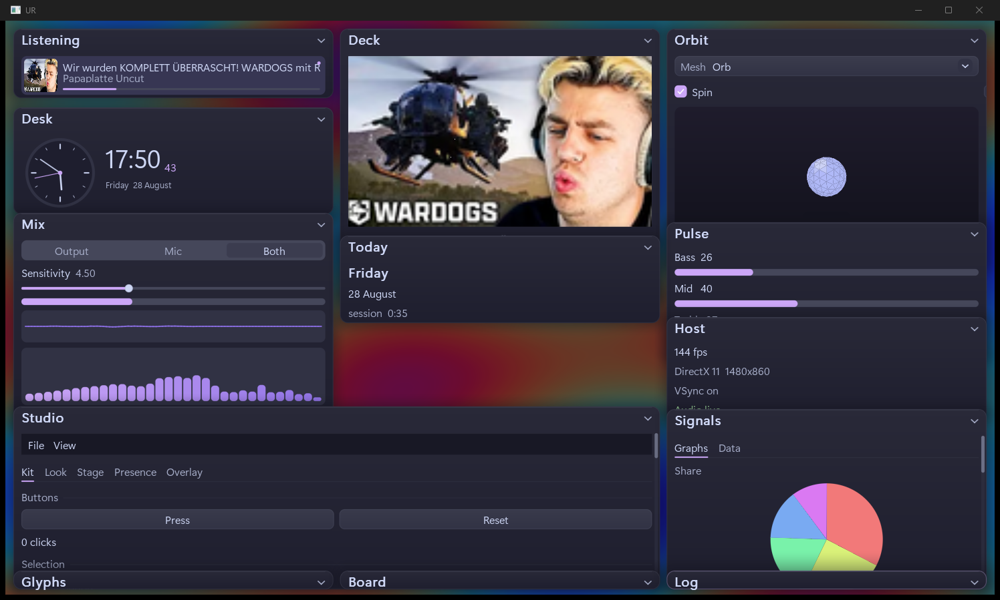

# ur

Immediate-mode UI for Windows. One header, `ur::app::run`, widgets every frame. Win32 owns the window, DPI, and input. The same tree draws on Direct3D 11, Direct3D 12, or OpenGL. Vulkan is off unless you build with `-DUR_VULKAN=ON` and the Vulkan SDK.



Auto tries DX11, then DX12, then OpenGL. Switching backend rebinds glyphs and fullscreen effects. The widget calls stay the same.

## What is in it

Buttons, sliders, fields, tables, tabs, menus, plots. Frames drag, resize, and collapse. Docking, a command palette, toasts, and themes are there if you turn them on. Desk extras (now playing, audio meters, clock, orbit, Discord presence, click-through) live in the showcase, not in the twenty-line sample.

IDs use `##`. `"OK##save"` is unique. `"Desk###face"` shows as Desk.

## Build

Windows 10 SDK, MSVC, CMake 3.20, Ninja.

```
cmake --preset windows-release
cmake --build --preset windows-release
```

| Output | |
| --- | --- |
| `build/windows-release/Hello.exe` | short start |
| `build/windows-release/Showcase.exe` | full desk |

Keep `assets/` next to the exe, or run from this directory.

## Hello

```cpp
#include "ur/ur.hxx"

int WINAPI WinMain( HINSTANCE, HINSTANCE, LPSTR, int ) {
    ur::app::Config Config;
    Config.title = "My tool";
    Config.backend = ur::Backend::DX11;
    return ur::app::run( Config, [ ] {
        if ( ur::ui::window Window( "Hello" ); Window ) {
            ur::ui::label( "Direct3D 11, Direct3D 12, or OpenGL." );
            if ( ur::ui::button( "Quit" ) )
                ur::app::quit( );
        }
    } );
}
```

`DX11`, `DX12`, `OpenGL`, `Vulkan`, or `Auto`.

## Files

```
include/ur     public headers
src/app        window, settings, theme
src/engine     widgets, layout, backends
src/host       D3D11, D3D12, OpenGL, Vulkan
src/ui         toast, palette, motion
demos/hello
demos/showcase
```

Widget notes are in [docs/start.md](docs/start.md). Compile notes are in [docs/build.md](docs/build.md).

Copy `.env.example` next to the exe if you want Discord (`UR_DISCORD_APP_ID`) or Spotify (`UR_SPOTIFY_CLIENT_ID`). Now playing uses the Windows media session. Hear can follow output, the mic, or both.
